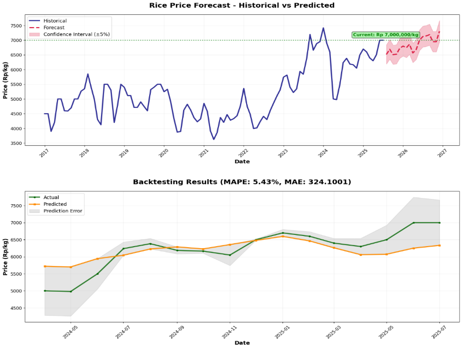
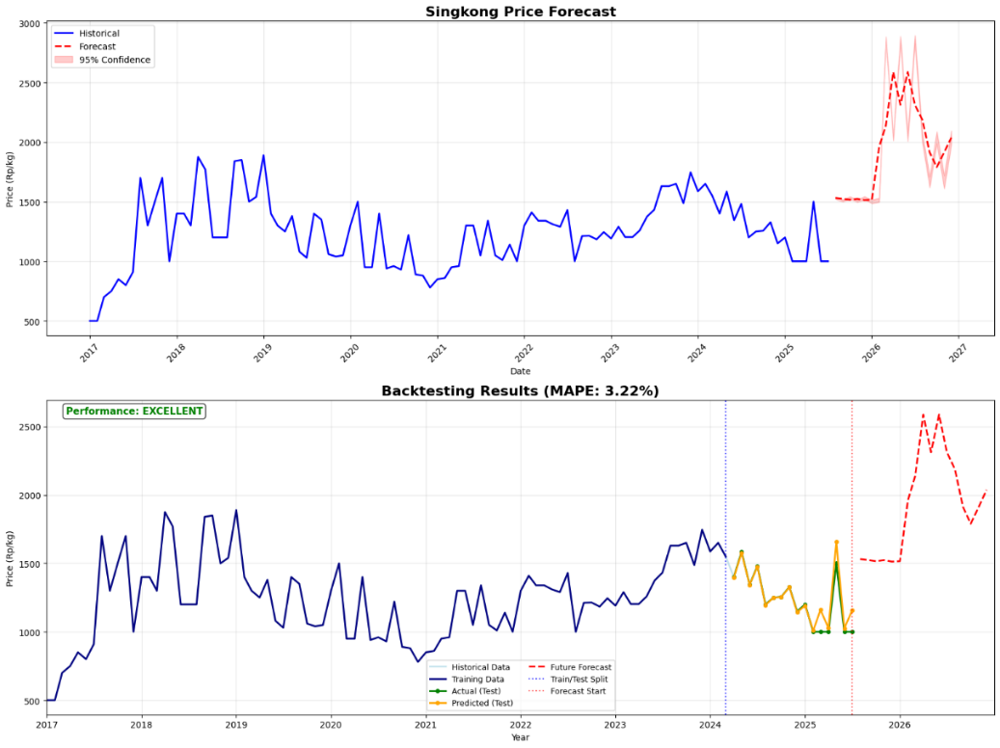

# Forecasting Padi dan Singkong  

Repositori ini berisi data, kode, dan hasil prediksi harga komoditas **padi dan singkong** menggunakan metode forecasting.  

## Struktur File  

- **Dataset.xlsx**  
  Berisi data historis harga padi dan singkong dari **Januari 2017 sampai Juli 2025**. Dataset ini menjadi sumber utama dalam proses analisis dan forecasting.  

- **Forecast_Padi_dan_Singkong.ipynb**  
  Notebook Python yang berisi kode untuk melakukan forecasting harga padi dan singkong berdasarkan dataset historis. Notebook ini mencakup tahap preprocessing data, pembuatan model, hingga visualisasi hasil prediksi.  

- **Prediksi Padi & Singkong.xlsx**  
  File hasil output dari forecasting. Berisi nilai prediksi harga padi dan singkong sesuai periode yang dianalisis.  

## Tujuan  
Proyek ini bertujuan untuk memberikan gambaran tren harga komoditas padi dan singkong di Indonesia sehingga dapat mendukung pengambilan keputusan dalam sektor pertanian maupun analisis ekonomi.  

## Cara Penggunaan  
1. Buka file **Dataset.xlsx** untuk melihat data historis.  
2. Jalankan notebook **Forecast_Padi_dan_Singkong.ipynb** untuk melakukan forecasting.  
3. Lihat hasil prediksi pada file **Prediksi Padi & Singkong.xlsx**.  

## Hasil Visualisasi  

### Prediksi Harga Padi

### Prediksi Harga Singkong

